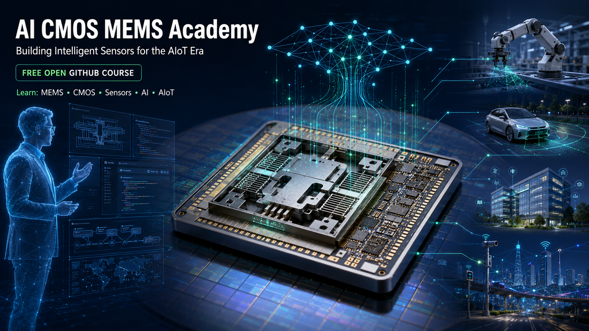

# AI CMOS MEMS Academy

## Building Intelligent Sensors for the AIoT Era


<p align="center">



</p>


<p align="center">


</p>


# Welcome to AI CMOS MEMS Academy 🚀


## Building the Sensor Intelligence Foundation for the AIoT Era


Artificial Intelligence is transforming our world.

However, AI systems cannot understand the physical world without sensing.

The next generation of intelligent systems requires:


```
Physical World

        ↓

CMOS MEMS Sensors

        ↓

Sensor Data

        ↓

AI Models

        ↓

Intelligent Decisions
```


AI CMOS MEMS Academy teaches how semiconductor technology, MEMS sensors, hardware systems, and artificial intelligence combine to build intelligent machines.

---

# Why CMOS MEMS for AI?


Today's AI revolution is powered by data.

But where does real-world data come from?


# Sensors.


CMOS MEMS sensors provide:


- Small size
- Low cost
- Low power consumption
- High sensitivity
- Mass manufacturability


They are becoming the sensing foundation for:


- 🤖 Robotics
- 🚗 Smart Vehicles
- 🏙 Smart Cities
- 🏢 Smart Buildings
- 🌐 AIoT Systems


---

# What is AI CMOS MEMS Academy?


AI CMOS MEMS Academy is an open GitHub-based engineering education platform connecting:


```
Semiconductor Technology

        +

MEMS Sensors

        +

Hands-on Hardware

        +

Artificial Intelligence

        =

Intelligent Sensor Systems
```


Our mission:


> Train the next generation engineers who can design intelligent sensing systems for the AIoT era.


---

# Start Learning


Explore the AI CMOS MEMS learning journey:


📘 [Course Overview](docs/course-overview.md)


🗺️ [Learning Roadmap](docs/learning-roadmap.md)


🤖 [AI CMOS MEMS Agent Guide](docs/ai-agent-guide.md)


---

# Who Should Learn?


## 🎓 Engineering Students


Recommended for students in:


- Electrical Engineering
- Mechanical Engineering
- Semiconductor Engineering
- Robotics
- Computer Engineering
- Artificial Intelligence


You will learn how AI connects with physical sensors.


---

## 👨‍💻 Semiconductor Engineers


Understand:


- MEMS technology
- CMOS MEMS integration
- Sensor applications
- AI hardware trends


---

## 🤖 AI and Robotics Developers


Learn:


- Where AI data comes from
- How machines perceive the physical world
- How sensors enable intelligent systems


---

# Learning Roadmap


## Module 0

# AI Needs Sensors


Understand:


- Why AI requires physical-world data
- Sensor revolution
- AIoT ecosystem


---

## Module 1

# MEMS Fundamentals


Learn:


- What is MEMS?
- Microsystem technology
- Scaling effects
- Sensing and actuation principles


---

## Module 2

# Semiconductor Foundation


Learn:


- Silicon technology
- Integrated circuits
- CMOS technology
- More-than-Moore evolution


---

## Module 3

# MEMS Fabrication Technology


Explore:


- Microfabrication
- Thin film processes
- Photolithography
- Etching


---

## Module 4

# CMOS MEMS Intelligent Sensors


Study:


- Pressure sensors
- Accelerometers
- Gyroscopes
- MEMS microphones
- Optical MEMS


---

## Module 5

# Hands-on MEMS Laboratory


Learn by building:


```
Concept

↓

Hardware Experiment

↓

Sensor Measurement

↓

Data Analysis

↓

Intelligent System
```


Using:


- Low-cost Arduino platforms
- MEMS sensor modules
- Real-world measurement


---

## Module 6

# AI Enabled Sensing


Learn:


- Sensor data intelligence
- AI-assisted engineering
- Intelligent sensing systems


---

## Module 7

# AIoT Applications


Explore:


- Robotics
- Smart Cars
- Smart Buildings
- Smart Cities


---

# Learn with Your AI CMOS MEMS Professor


## Meet:


# Prof. Yi-Kuen Lee AI CMOS MEMS Agent


Your AI learning assistant can help you:


## 📚 Learn Concepts


Example:


> Explain how a CMOS MEMS accelerometer works.


---

## 🔧 Support Engineering Practice


Example:


> Help analyze my MEMS sensor measurement results.


---

## 🔬 Explore Research Topics


Example:


> Compare different CMOS MEMS sensing technologies.


---

# Hands-on Engineering Philosophy


This course follows:


# Learn → Build → Measure → Analyze → Create


Students will not only learn:


"What is a MEMS sensor?"


They will experience:


"How to build intelligent sensing systems."


---

# Course Repository Structure


```
AI-CMOS-MEMS-Academy/

│
├── README.md
├── index.yaml
│
├── assets/
│
├── docs/
│
├── module-00-ai-era/
├── module-01-mems-foundation/
├── module-02-semiconductor/
├── module-03-fabrication/
├── module-04-cmos-mems/
├── module-05-hardware-lab/
├── module-06-ai-sensing/
├── module-07-aiot-applications/
│
├── labs/
├── projects/
│
└── ai-agent/
```


---

# AI CMOS MEMS Agent


The AI CMOS MEMS Agent represents a new model of AI-assisted engineering education.


It combines:


```
Professor Knowledge

        +

AI Assistance

        +

Engineering Practice

        =

Personalized Learning Experience
```


---

# Future Learning Path


This free GitHub course is the foundation of a complete AI CMOS MEMS education ecosystem:


```
Free GitHub Course

        ↓

AI CMOS MEMS Agent

        ↓

Professional CMOS MEMS Engineer Program

        ↓

Enterprise Training

        ↓

CMOS MEMS Consulting
```


---

# Open Source Community


We welcome contributions from:


- Students
- Engineers
- Researchers
- Educators


Possible contributions:


- Learning examples
- MEMS projects
- AI sensor applications
- Laboratory improvements


---

# Join the AI Sensor Revolution


AI needs data.

Data needs sensors.

Sensors build intelligent systems.


Start your journey:


# Building Intelligent Sensors for the AIoT Era


⭐ Star this repository and join the AI CMOS MEMS community.