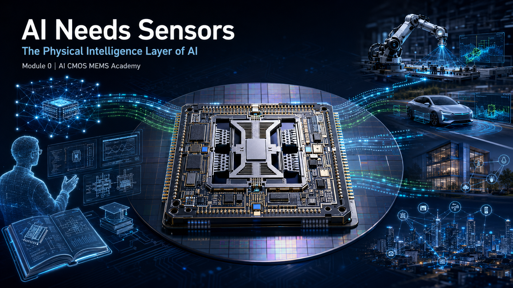

# Module 0: AI Needs Sensors

## Building the Physical Intelligence Layer for Artificial Intelligence

<b>
AI CMOS MEMS Academy | Module 0 | AI Era
</b>

---

# 🚀 Start Here: AI Needs Sensors

## Watch the 60-Second Introduction Video

Artificial Intelligence is transforming the world.

But one fundamental question remains:

# How does AI understand the physical world?

The answer:

# Sensors.

🎬 **AI CMOS MEMS Academy - Module 0 Introduction Video**

👉 Coming soon:

[Watch the AI Needs Sensors 60-second Introduction Video](YOUR_YOUTUBE_VIDEO_LINK)

This video explains:

- Why AI needs physical-world data
- Why sensors are the foundation of intelligent systems
- Why CMOS MEMS sensors are critical for AIoT   